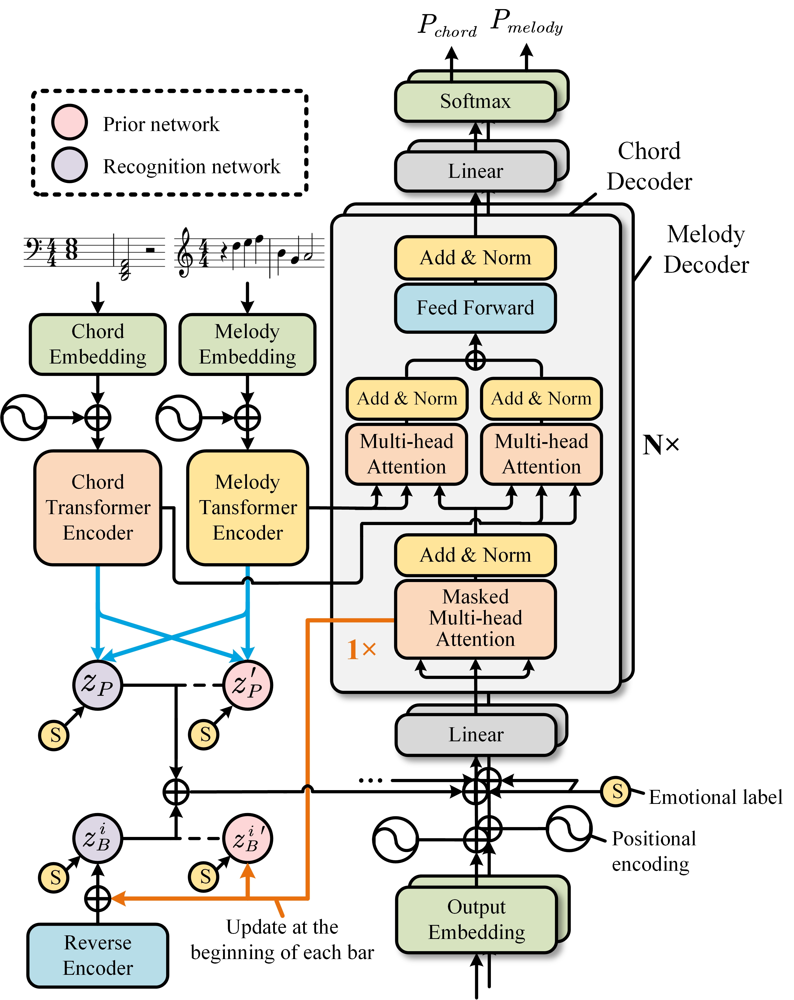
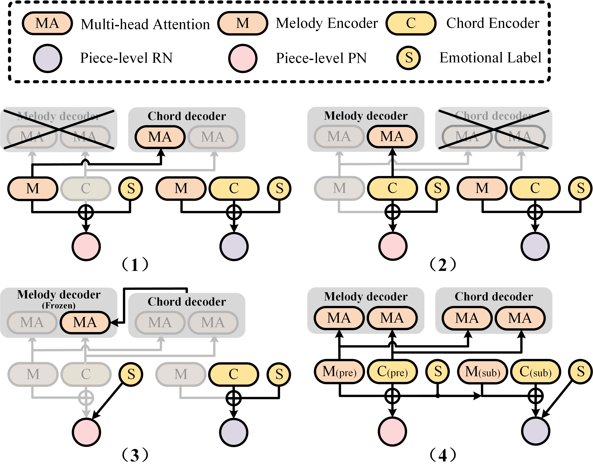

# EmoMusicTV
This is the official implementation of EmoMusicTV, which  is a transformer-based variational autoencoder (VAE) that contains a hierarchical latent variable structure to explore the impact of time-varying emotional conditions on multiple music generation tasks and to capture the rich variability of musical sequences. <br>
- [Paper link](https://ieeexplore.ieee.org/abstract/document/10124351)
- Check our [demo page](https://tayjsl97.github.io/demos/tmm) and listen!<br>
<br>



# Data Interpretation
👇Interpretation of index in melody.data 
Index | Definition
-------|----------
0 | bar mark
1-61 | pitch (1 for rest, 2-61 for pitch 42-101)
62-98 | duration (mapping dict in chordVAE_eval.py)
99-106 | time signature (mapping dict in chordVAE_eval.py)

Consequently, each melody event is represented by a 107-D one-hot vector.

👇Interpretation of index in chord.data 
Index | Definition
-------|----------
0-6 | chord mode (0 for rest, mapping dict in chordVAE_eval.py)
0-40 | root tone (40 for rest, 0-39 for pitch 30-69)

Consequently, each chord event is represented by a 48-D vector (concatenation of 7-D and 41-D).

👇Interpretation of index in valence.data 
Index | Definition
-------|----------
-2 | very negative
-1 | moderate negative
0 | neutral
1 | moderate positive
2 | very positive

Consequently, each emotional label is represented by a 5-D one-hot vector.

# Reference
If you find the code useful for your research, please consider citing
```bib
@article{ji2023emomusictv,
  title={EmoMusicTV: Emotion-conditioned Symbolic Music Generation with Hierarchical Transformer VAE},
  author={Ji, Shulei and Yang, Xinyu},
  journal={IEEE Transactions on Multimedia},
  year={2023},
  publisher={IEEE}
}
```
